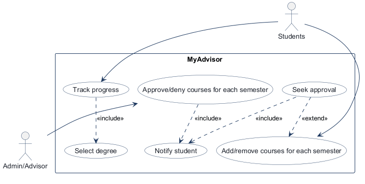
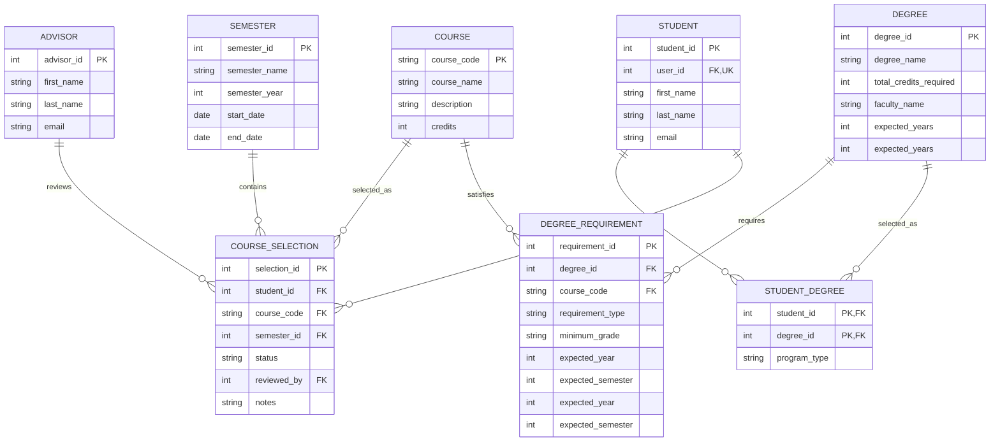

# COMP 3613 Assignment 1

Draft this file with the Guide. **Update it after every phase milestone** before you pause. The use-case diagram is a UML PNG at `docs/diagrams/use-case.png`, linked from this file as `diagrams/use-case.png` (path relative to `docs/report.md`). The model diagram is Mermaid. **Embed wireframe images** as `wireframes/<file>` (files live in `docs/wireframes/`).

Do not put your student ID in this file if you will commit it. The PDF cover adds your name and ID at export time.

## Assigned project

MyAdvisor — students track degree progress, plan semester course selections, and obtain approval from an administrator / advisor.

## Three workflows

### 1.

Select degree and track progress (Students)

### 2.

Add/remove courses for each semester (Students)

### 3.

Approve/deny courses for each semester (Admin/Advisor)

## Use case diagram

Phase 2 notes:

- **«include»:** Track progress always includes Select degree. Seek approval always includes Notify student (pending). Approve/deny courses always includes Notify student (approved or denied, including push).
- **«extend»:** Seek approval extends Add/remove courses for each semester — only when the student is sure about that semester’s list. Add/remove can repeat without seeking approval. Approval is still required for each semester.
- **Shared across actors:** none of the named Phase 1 use cases. Notify student is a nested step (no extra actor lines), included from Seek approval and from Approve/deny.
- **Added from the edge-case answer:** Seek approval (Students); Notify student for pending / approved / denied (toast plus push).
- **Deliberate gap:** starter login/session is supporting behaviour, not a named use case.

## Model diagram

First draft. Update this section in Phase 5 when polish revises the model, and note what changed.

Phase 3 notes:

- Students can pursue multiple degrees, including majors, minors, and specials; `STUDENT_DEGREE.program_type` classifies each student-degree association as Major, Minor, or Special.
- A course is selected by many students across many semesters through CourseSelection, which records the semester, enrollment status, and advisor review.
- DegreeRequirement ties a degree to a course and records the rule that must be satisfied, such as a minimum grade or requirement type.
- The relationship between Advisor and CourseSelection is review-based: an advisor may review many course selections, while each selection may be reviewed by one advisor.
- Phase 4 revision: `DEGREE.faculty_name` reflects the faculty grouping shown in the degree-selection screens; `COURSE_SELECTION.notes` stores notes attached to a student's selected course.
- Phase 5 model refinement: replaced `STUDENT.degree_id` with the `STUDENT_DEGREE` bridge so a student can pursue multiple majors and minors; `STUDENT.user_id` links each student profile to one registered account.

## Wireframes

### Student degree tracking and course planning — desktop

<!-- student-build:wireframe-coverage
use_case: Track progress
image: docs/wireframes/Desktop version wireframe.png
covered: yes
-->
<!-- student-build:wireframe-coverage
use_case: Select degree
image: docs/wireframes/Desktop version wireframe.png
covered: yes
-->
<!-- student-build:wireframe-coverage
use_case: Add/remove courses for each semester
image: docs/wireframes/Desktop version wireframe.png
covered: yes
-->
<!-- student-build:wireframe-coverage
use_case: Seek approval
image: docs/wireframes/Desktop version wireframe.png
covered: yes
-->

### Advisor course review — desktop

<!-- student-build:wireframe-coverage
use_case: Approve/deny courses for each semester
image: docs/wireframes/Desktop version wireframe 2.png
covered: yes
-->

### Student degree tracking and course planning — mobile

### Advisor course review — mobile

<!-- student-build:wireframe-coverage
use_case: Notify student
image: docs/wireframes/Desktop version wireframe 2.png
covered: yes
-->

### Coverage note

The student screens show pending submission and approved/denied semester statuses. These visible outcomes cover `Notify student`; toast/push delivery is not depicted in the wireframes.

`python manage.py report` also embeds any PNG/JPG still missing from `docs/wireframes/`.

## Theming

- **Colors:** deep navy background, tech blue, teal, and white accents.
- **Type:** sans serif (Manrope).
- **Tone:** modern and techy; not a university portal.
- **Logo / wordmark:** plain `MyAdvisor` text with a subtle tech glow.
- **Applied to:** public landing, login, registration, and authenticated shell.
- **Visual refinement:** deep navy background with blue/teal glows, dark surfaces for cards and forms, centered top-bar wordmark, warning alerts in pale blue to avoid orange UI accents.
- **Verification:** student requested modern techy deep-navy retheme; follow-up polish made the semester 3-dot menu visible and restyled all popups for the dark theme. Student verified: overall look great, dots visible, popups clean — perfect. Replaced the tab icon with a sleek black square `MyA` SVG favicon. Made the centered top-bar `MyAdvisor` wordmark clickable back to Home (admin/student aware). Student verified: click goes home — yes.

## Implementation notes

One named workflow at a time. Include verify notes and polish / model revisions (Phase 5). Do not treat the first build as final.

- **Role provisioning:** public registration creates Student accounts; Admin/Advisor access remains seeded for testing and is not selectable during public registration. Bob's seeded `current_year` is Year 3 (fresh profiles start there; existing default Year 1 profiles migrate up). All degrees now sit under Faculty of Science and Technology; any legacy Faculty of Science rows migrate on seed so that faculty disappears. Degrees were renamed to BSc Computer Science (Major) and BSc Mathematics (Minor), with duplicate-name merges keeping the assigned degree. The old BSc Computer Science catalog entry was retired — its courses (COMP1600, COMP1601, COMP2603, COMP2611, COMP3613) already live as requirements on BSc Computer Science — as was the colliding BSc Mathematics catalog entry, leaving one degree per name.
- **Completed-courses seed (bob):** Year 1 Sem 1: COMP1600, COMP1601, INFO1600, MATH1150, FOUN1101; Year 1 Sem 2: COMP1602, COMP1604, INFO1601, FOUN1301; Year 1 Sem 3: COMP1603; Year 2 Sem 1: COMP2601, COMP2602, COMP2605, COMP2611, MATH2250; Year 2 Sem 2: COMP2604, COMP2606, INFO2602, INFO2604, FOUN1105; Year 2 Sem 3: COMP2603. Seeded as `completed` selections across 2023–2024 semesters on every `seed`/`init --no-drop`.
- **CS-only scoping:** those 21 courses plus CSCI110 are seeded as Computer Science (Major) `DEGREE_REQUIREMENT` rows (Core), and the Completed view now filters by the viewed degree's requirements — so the history shows only under the Computer Science degree, not Mathematics. Adding a completed course under a degree also tags it as that degree's requirement. The extra-semester year mapping is scoped per degree too, and reusing a shared semester row with no selections of yours counts as added instead of a false duplicate. Student verified: CS-only history, Math add-semester fix — good.
- **Year 3 roadmap seed (CS):** Year 1 Sem 1/2 and Year 2 Sem 1/2 have no remaining courses (all completed). Year 3 Sem 1 Core: COMP3602, COMP3603, COMP3991; Electives: COMP3605, COMP3606, COMP3607, COMP3612, COMP3613, INFO2605, INFO3600, INFO3605. Year 3 Sem 2 Core: COMP3601, INFO3604; Electives: COMP3608, COMP3609, COMP3610, COMP3611, COMP3612, INFO3606, INFO3607, INFO3608, INFO3611 (all 3 credits). COMP3612 appears in both semesters, so it holds two requirement rows; shared catalog titles were aligned to these names. Student verified: Year 3 lists match — good. BSc Mathematics gets a small seeded roadmap (Year 1: MATH3273 Core, MATH3277 Core; Year 2: MATH3278 Elective, MATH2210 Core; anything else pruned). Student verification pending.

<!-- student-build:code-check
workflow: Select degree and track progress
form: snippet
layer: router
architecture_ok: yes
implement_confidence: 0.70
passed: partial
note: Guide wired degree_id through the completed view and add action after the student hit the missing-arg error.
-->
- **Advisor workflow decision:** the existing seeded `admin` login also acts as Advisor and links to one Advisor profile. Review actions apply to the semester's submitted courses as a group, following the advisor wireframe. A denial requires an explanation; the Advisor's notes are saved with the selections and shown to the student on the semester page.
- **Advisor review implementation:** `/admin/advising` lists pending semester submissions grouped by student and semester with the submitted courses. The seeded `admin` account is linked to an Advisor profile. Approval may include optional notes; denial requires notes, and those notes appear beside denied courses in the student's semester plan. Student/Advisor workflow verification is pending.
- **Workflow 1 refinement:** assigned Major/Minor/Special degree cards appear on the student home page. Clicking a card opens a degree action page with `Track degree` and `Plan semester`. Tracking a degree opens `Completed courses` and `Remaining courses` actions. Students may record previously completed courses and add past semesters; a grade is not required. Completed courses shows code-only entries grouped by collapsible `Year 1`, `Year 2`, etc. sections and horizontal collapsible semester columns; clicking a code opens course details and a delete action that removes only the student's completion record. Every semester has an `Add course` dialog and a `Delete semester` action. Deleting a semester removes this student's completed entries and deletes the shared semester row only when no selections reference it. The `Add extra semester` dialog appears at the end of page content and asks for a `Year N` label and one of three semester radio choices; the label maps to a real calendar year for stored semester dates. Remaining courses shows the degree roadmap for `DEGREE.expected_years`, with three horizontal semester columns per year. Uncompleted `DEGREE_REQUIREMENT` rows appear in their expected term, separated into Core and specific Elective courses; Semester 3 is marked optional. Completed courses are removed from the roadmap. Course codes open an information dialog, and no add/delete controls appear on this page. Degree requirements without an expected term are outside the roadmap and should be assigned during curriculum setup. The authenticated sidebar stays viewport-height and sticky while long page content scrolls. Student verification of this refinement is pending.
- **Plan semester decisions:** registration collects the student's current year of study. The picker shows only three plain options (Semester 1, 2, and 3) for that registered academic year; existing profiles default to Year 1. Selecting an option opens a separate semester detail page with courses, Add course fields, and Submit for approval. While a semester is pending advisor review, students cannot add, edit, or remove courses; editing reopens after approval or denial. Re-submitting a course already in the same semester shows a warning toast that it is a duplicate.

<!-- student-build:code-check
workflow: Plan semester
form: choice
layer: service
architecture_ok: yes
implement_confidence: 0.75
passed: yes
note: Student chose Service to coordinate the pending lock and duplicate-course outcome.
-->
<!-- student-build:code-check
workflow: Plan semester
form: snippet
layer: model
architecture_ok: yes
implement_confidence: 0.70
passed: yes
note: Student added a composite uniqueness constraint for student, course, and semester.
-->
<!-- student-build:code-check
workflow: Plan semester
form: snippet
layer: repository
architecture_ok: yes
implement_confidence: 0.55
passed: partial
note: Student attempted repository reads/writes; Guide corrected the Semester/Degree imports and degree scoping before continuing.
-->
<!-- student-build:code-check
workflow: Plan semester
form: snippet
layer: router
architecture_ok: yes
implement_confidence: 0.70
passed: yes
note: Student route loads planner data through SemesterPlanService using the signed-in user and degree ids.
-->
- **Plan semester polish:** Submit now stays visible for denied semesters and resubmits denied plus selected courses so students do not need delete-plus-add to bring it back; removed the per-course Pending badge so only the top `Pending advisor approval` shows. Student verified: submit reappears correctly, Pending only at top — perfect.
- **Plan semester implementation:** enabled the degree action link and split planning into a picker with exactly three semester buttons for the student's registered current year and a separate selected-semester detail page. Course rows have a larger three-dot menu with Edit and Remove actions. The Add course button opens a modal with course fields. Course additions create shared catalog entries and student selections; duplicate attempts and pending locks show warning toasts. Submitting selected courses changes them to pending, and pending semesters hide editing/submission controls. Editing course details updates the shared `COURSE` catalog record; Remove deletes only this student's selection. Registration collects first/last name and current year; an additive schema migration defaults existing profiles to Year 1. Student verification of the picker-to-detail flow is pending.
- **Remaining courses roadmap:** added `DEGREE.expected_years` and `DEGREE_REQUIREMENT.expected_year` / `expected_semester`. The Remaining page groups unmet course requirements into Core and Elective sections for each planned term, excludes courses with completed student selections, and labels the third semester optional. Existing databases receive additive defaults; sample seed data includes a three-year Computer Science roadmap and a two-year Mathematics roadmap.

<!-- student-build:code-check
workflow: Select degree and track progress
form: choice
layer: model
architecture_ok: yes
implement_confidence: 0.85
passed: yes
note: Student chose to constrain Special in SQLModel so Major/Minor/Special stay consistent.
-->
<!-- student-build:code-check
workflow: Select degree and track progress
form: snippet
layer: model
architecture_ok: yes
implement_confidence: 0.65
passed: partial
note: Student first set program_type to a Literal alias; Guide corrected to str with pattern because Literal breaks SQLModel table mapping.
-->
<!-- student-build:code-check
workflow: Select degree and track progress
form: snippet
layer: model
architecture_ok: yes
implement_confidence: 0.70
passed: yes
note: Corrected STUDENT_DEGREE.program_type to str with Major/Minor/Special pattern so Special validates without issubclass error.
-->
<!-- student-build:code-check
workflow: Select degree and track progress
form: snippet
layer: router
architecture_ok: yes
implement_confidence: 0.85
passed: yes
note: Student completed thin degree_actions_view by constructing StudentDegreeService from the repository.
-->
- **Workflow 1 polish:** moved `MyAdvisor` from the sidebar into the centered top bar; removed the inner horizontal scrollbar on Completed courses so semester columns wrap and only page scroll remains, with single-column stacking on small screens; made `Delete semester` discrete with muted small text; added `Special` as a `STUDENT_DEGREE.program_type` alongside Major and Minor and updated degree-card copy; made semester cards equal height so adding a course no longer leaves uneven cards, with collapsed semesters shrinking to header size. Student verified: centered wordmark, no inner scroll, discrete delete, Special type, even cards with shrinking collapsed state — perfect.

<!-- student-build:code-check
workflow: Approve/deny courses for each semester
form: mcq
layer: service
architecture_ok: yes
implement_confidence: 0.80
passed: yes
note: Student chose Service for the deny-without-notes rejection.
-->
<!-- student-build:code-check
workflow: Approve/deny courses for each semester
form: snippet
layer: model
architecture_ok: yes
implement_confidence: 0.75
passed: yes
note: Student kept COURSE_SELECTION.notes as the denial-explanation field.
-->
<!-- student-build:code-check
workflow: Approve/deny courses for each semester
form: snippet
layer: router
architecture_ok: yes
implement_confidence: 0.80
passed: yes
note: Student kept advisor_decide_semester_action thin by constructing repository plus service and calling decide_semester.
-->
- **Advisor review verified:** `/admin/advising` groups pending semesters with submitted courses; denial requires notes and surfaces them to the student semester page. Student verified: approve works, deny without notes shows the error, deny with notes updates the student page — yes it works.
- **Advisor dedup:** students with two degrees now appear for approval under one degree only (their Major, else first assigned), since plan semesters are shared across degrees; the decision still shows on the student's side under each degree. Student verified: single listing, visible under both degrees — good.
- **Toast polish verified:** advisor `Semester approved / denied` alerts and all success toasts auto-dismiss after about four seconds; removed the student `Needs attention` warning popup so warnings no longer show as a toast box; removed per-course Approved/Denied/Pending badges so only the top semester status shows with one persistent advisor-feedback line above the course list. Student verified: toasts vanish, warning box gone, feedback stays above the list — yes.

## Deployed app

Phase 6. Public Render URL (not localhost). Markers open this to mark the three workflows.

https://myadvisor-choc.onrender.com

## Logins

Every account a marker needs, including extra users you added. Starter accounts:

- bob / bobpass — student
- admin / adminpass — advisor (admin)

## YouTube URL

## Session transcripts

Filled when the Guide builds the report: the agent writes each Guide chat to `docs/transcripts/<slug>.md` (Copilot Agent, Cursor, or OpenCode). `python manage.py report` packages them. Do not paste chats here during the build.

## Competency (student-judge)

Filled when the report is built. Guide runs student-judge, writes `docs/judge.md`, and export appends the scorecard here.

## Skill integrity

Filled by `python manage.py report`. Do not edit the course skills.
